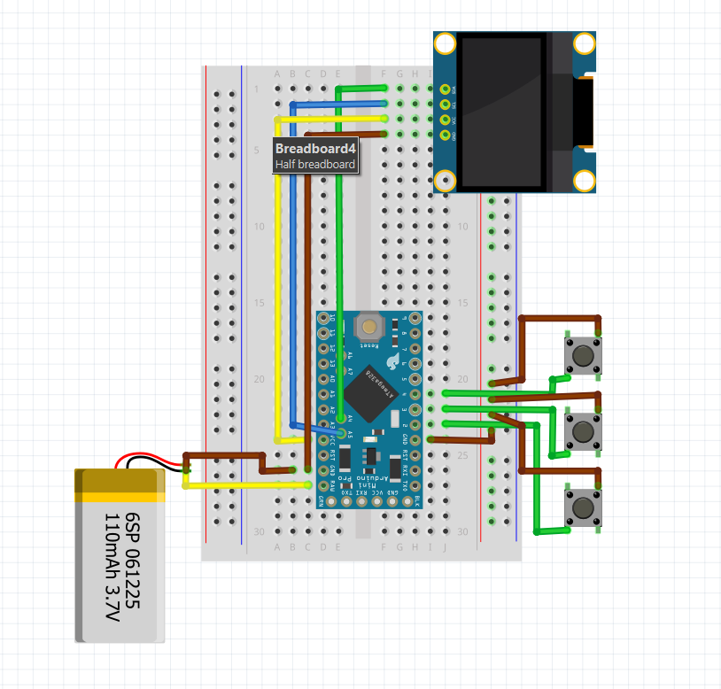

# 🐾 Arduino Virtual Pet Project

This project is an interactive **virtual pet system** using an OLED display and buttons. The user can **feed**, **love**, **play with**, and **put the pet to sleep**. The pet's facial expressions and status bars are displayed on the screen. A **menu system** controlled by buttons is also included.

## 🚀 Features

- 128x64 pixel OLED display (SH1106)
- Menu navigation and interaction via 3 buttons
- Status bars: Happiness, Fullness, Fun, Energy
- Bars decrease over time and increase through user interaction
- Animated facial expressions (happy, sad, sleepy, etc.)
- Heart animation for affection interactions

## 🖼️ Hardware Wiring Diagram (Fritzing)

## 🧠 Required Hardware

- Arduino Pro Mini
- SH1106 128x64 OLED display (I2C)
- 3 push buttons (menu up, down, select)
- Jumper wires and breadboard
- 3.7v lipo battery

## 🔧 Setup Instructions

1. Open the Arduino IDE.
2. Install the required libraries:
   - `U8g2` (U8g2lib – for OLED graphics)
3. Copy the code into a file named `sketch.ino` or open it directly.
4. Select your Arduino board and upload the code.
5. Verify the project is working by observing the OLED and interacting with the buttons.

## 📝 Usage

- **Select Button**: Opens/closes the menu, confirms selections.
- **Up/Down Buttons**: Navigate through the menu.
- Menu options include:
  - **Feed**: Increases fullness with options like food, drink, or dessert.
  - **Love**: Increases happiness via hug, kiss, or gift.
  - **Play**: Boosts the fun bar (optional mini-games like Snake can be integrated).
  - **Sleep**: Restores energy by sleeping.

## 💡 Future Improvements

- Real-time clock (RTC) module for time-based events
- Store bar values in EEPROM for persistence
- Add games (Tetris, Pong, etc.)
- Add sound alerts and melodies using the buzzer

## 📜 License

Distributed under the MIT License. See the `LICENSE` file for more information.

---

This is a hobby and learning project. Feel free to use and improve it. If you like the project, don’t forget to ⭐ star the repository to support it!
